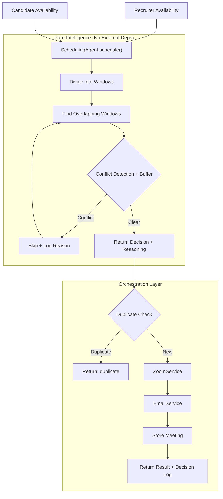
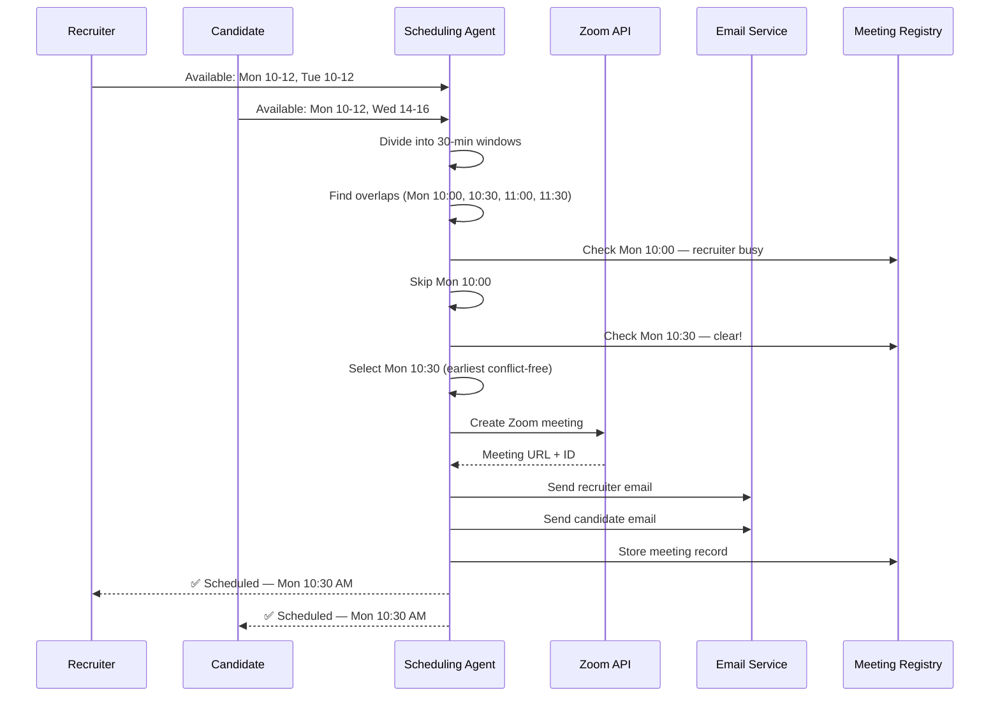

# Scheduling Agent

**An AB Talks Open Agent**

> Automatically coordinates recruiter–candidate interviews by intelligently matching availability, preventing scheduling conflicts, creating Zoom meetings, and emailing both participants.

---

## Problem Solved

Recruiters waste hours coordinating interview times over email threads. This agent eliminates that entirely. Give it two sets of availability, and it handles the rest — finding the best slot, avoiding double-bookings, creating the Zoom room, and notifying everyone.

---

## Why This Is an Agent

| Capability | Description |
|---|---|
| **Autonomous decisions** | Picks the best slot, not just any slot |
| **Conflict resolution** | Checks existing meetings, skips double-bookings |
| **Duplicate detection** | Prevents accidental re-scheduling |
| **External tool usage** | Zoom API + SMTP — creates real meetings, sends real emails |
| **Explainability** | Returns an Agent Decision Log explaining every choice |
| **Buffer awareness** | Respects configurable break time between meetings |
| **Zero human intervention** | End-to-end workflow with no manual steps |

---

## Architecture



The agent is **pure intelligence** — it returns decisions, not side effects. The router handles Zoom, Email, and persistence. Replace Zoom with Google Meet tomorrow and the agent doesn't change.

---

## Example Workflow



---

## Playground

Open `playground.html` in your browser and point it at your running backend. No code required.

The playground includes:
- **Recruiter & Candidate** panels with slot management
- **Duration & Buffer** preset buttons (15/30/45/60 min)
- **Schedule Interview** button that calls the real API
- **Execution Timeline** showing each step as it happens
- **Agent Decision Log** explaining why each slot was chosen or skipped
- **Meeting Dashboard** with status badges (🟢 🔴 🟡) and cancel buttons
- **Agent Metrics** — meetings scheduled, avg time, conflicts resolved, emails sent

---

## API Reference

### `POST /api/schedule`

Schedule a new interview.

**Request:**
```json
{
  "recruiter": {
    "name": "Sarah Chen",
    "email": "sarah@company.com",
    "availability": ["2025-07-15T10:00:00Z", "2025-07-15T14:00:00Z"]
  },
  "candidate": {
    "name": "Alex Johnson",
    "email": "alex@email.com",
    "availability": ["2025-07-15T10:00:00Z", "2025-07-15T16:00:00Z"]
  },
  "duration_minutes": 30,
  "buffer_minutes": 15
}
```

**Response:**
```json
{
  "status": "scheduled",
  "selected_slot": "2025-07-15T10:00:00+00:00",
  "meeting_url": "https://zoom.us/j/123456789",
  "meeting_id": "123456789",
  "meeting_password": "abc123",
  "emails_sent": true,
  "reasoning": [
    "Recruiter has 2 possible 30-min windows",
    "Candidate has 2 possible 30-min windows",
    "2 overlapping windows found",
    "Tuesday 10:00 AM selected — earliest conflict-free slot",
    "15-minute buffer respected",
    "Meeting duration: 30 minutes",
    "Zoom meeting created",
    "Emails sent to both participants",
    "Meeting stored in registry"
  ],
  "timeline": [
    {"step": "Loading existing meetings", "status": "done", "detail": "0 active meetings loaded"},
    {"step": "Running Scheduling Agent", "status": "done", "detail": "Agent returned: scheduled"},
    {"step": "Checking for duplicate meetings", "status": "done", "detail": "No duplicates found"},
    {"step": "Creating Zoom meeting", "status": "done", "detail": "Meeting 123456789 created"},
    {"step": "Sending recruiter email", "status": "done", "detail": "Sent to sarah@company.com"},
    {"step": "Sending candidate email", "status": "done", "detail": "Sent to alex@email.com"},
    {"step": "Storing meeting record", "status": "done", "detail": "Meeting abc-123 stored"}
  ]
}
```

### `GET /api/schedule/meetings`

List all meetings. Supports `?email=` and `?status=scheduled` filters.

### `GET /api/schedule/{meeting_id}`

Single meeting lookup.

### `DELETE /api/schedule/{meeting_id}`

Cancel a meeting. Sets status to `cancelled`.

### `POST /api/schedule/{meeting_id}/reschedule`

Cancel the existing meeting and schedule a new one with fresh availability. Sends reschedule notification emails.

---

## Quick Start

```bash
# 1. Start the HireIntel backend
cd backend
pip install -r requirements.txt
uvicorn main:app --reload

# 2. Run the example
cd Scheduling-Agent
pip install -r requirements.txt
python example.py
```

---

## Environment Variables

| Variable | Description | Required |
|---|---|---|
| `ZOOM_ACCOUNT_ID` | Zoom Server-to-Server OAuth Account ID | Yes |
| `ZOOM_CLIENT_ID` | Zoom OAuth Client ID | Yes |
| `ZOOM_CLIENT_SECRET` | Zoom OAuth Client Secret | Yes |
| `SMTP_SERVER` | SMTP server hostname | Yes |
| `SMTP_PORT` | SMTP server port (default: 587) | Yes |
| `SMTP_USERNAME` | Email address for sending | Yes |
| `SMTP_PASSWORD` | Email password or app password | Yes |

---

## Contributing

See [CONTRIBUTING.md](CONTRIBUTING.md) for guidelines.

## License

MIT — see [LICENSE](LICENSE).
