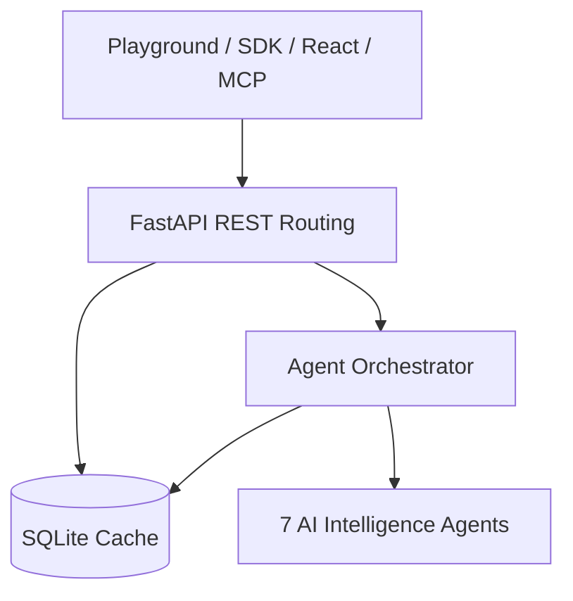

# HireIntel System Architecture

HireIntel uses an AI-Native decoupled architecture separating agent engines, runtime routing, database state, and integration endpoints.

---

## 1. Platform Component Layers

*   **7 AI Core Agents**: Resume parsing, Job Description blueprints, Readiness Matching, Adaptive Q&A, Transcript Judging, Reporting, and Upskill Roadmaps.
*   **Agent Orchestrator**: Handles session index state machines, prompt compilation, and SQLite database ID pre-loading.
*   **FastAPI REST Router**: Exposes paths, validates payloads using Pydantic, and returns execution metrics.
*   **Client Gateways**: Exposes `@hireintel/sdk` client, `@hireintel/react` widgets, and the `@hireintel/mcp-server` toolset.

---

## 2. Telemetry & Reliability Standards

*   **Observability parameters**: Exposes latency (ms), model engine name, LLM calls, cache status, tokens count, and estimated cost.
*   **Reliability Ratings**: Mapped to source evidence:
    *   `High`: Regex checks, header lines.
    *   `Medium`: Filename fallback.
    *   `Low`: Not found.
