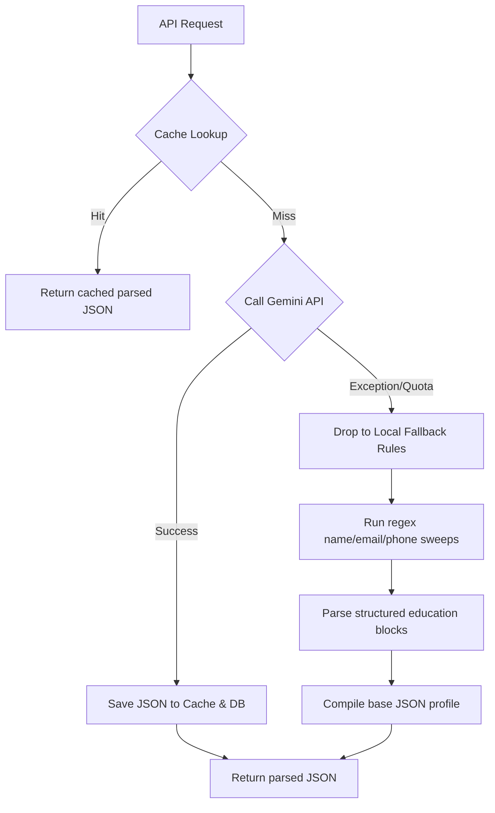

# 📖 HireIntel Product Bible

## Chapter 3: Platform Architecture & Agent Orchestration

This chapter defines the system architecture layers, orchestrator behaviors, and resilience engineering schemas.

---

## 1. System Layers Architecture

HireIntel uses a stateless decoupled architecture. The platform routes client requests through a central orchestrator which delegates work to specialized agents and data stores.

```text
  Core AI Agent Engines (7 Specialized Agents)
  ↓
  Agent Orchestrator (Coordinates state, context memory & DB lookups)
  ↓
  FastAPI Gateway (Provides OAuth and strictly validated REST routing)
  ↓
  Developer Integration Gateways (TypeScript SDK / React Widgets / MCP Server)
```

### Components:
1.  **AI Engines**: Seven agents that execute distinct, isolated prompt instructions.
2.  **Orchestrator**: Maintains interview state machines, tracks category indexes, compiles prompt schemas, and resolves database candidate IDs.
3.  **FastAPI REST Router**: Exposes endpoints and maps raw JSON and binary uploads.
4.  **Developer Gateways**: Packages API integrations into developer tools.

---

## 2. Telemetry & Observability Design

Every parsing or matching process compiles execution metrics:
*   **Execution Time (ms)**: System duration tracking.
*   **Model Engine**: Engine identifier (`SQLite Cache`, `Gemini 2.5 Flash`, or `Local Rules Heuristics`).
*   **LLM Calls Count**: Logs model executions (`0` or `1`).
*   **Cache Status**: Indicates `Hit` or `Miss`.
*   **Processed Token Volume**: Audit count of input/output tokens.
*   **Cost Calculations**: Cost estimation based on tokens used.

---

## 3. Resilience Fallback Loops

If remote LLM APIs encounter network timeouts, rate limit caps, or quota exhaustion, HireIntel automatically cascades to **Local Rules Heuristic Parsers**:



### Local Heuristics parameters:
*   **Resume Parse**: Local regex patterns for emails, phone numbers, and structural education scanning loops.
*   **Match Evaluation**: Local deterministic list intersection calculations.
*   **Interview simulator**: Pre-loaded question banks matching the target job description if generative prompts fail.
*   **rubric evaluator**: Evaluates word counts and response speed metrics locally if LLM rubric analysis fails.
